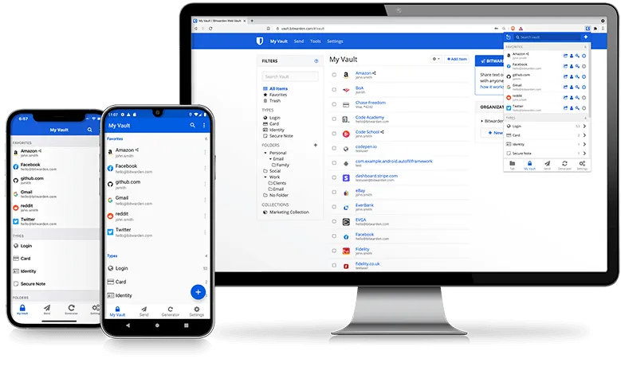
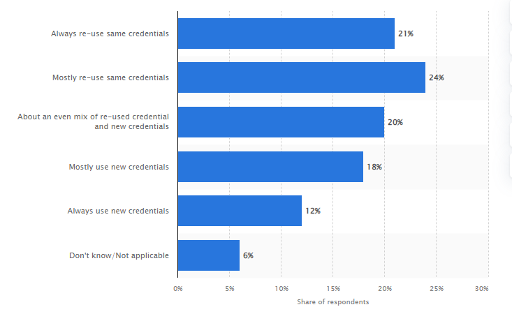

Move fast and securely with the password manager trusted by millions.  
  Drive collaboration, boost productivity, and experience the power of open source with Bitwarden,  
  the easiest way to secure all your passwords and sensitive information.  

[Get Started Today](https://vault.bitwarden.com/#/register?layout=default)

### Core features included in every Bitwarden account:
Open source, Zero-knowledge encryption,  
  Unlimited devices + syncing, Browser, Mobile, Desktop apps, Unlimited vault items,
Store notes, credit cards, identities, Free sharing for 2 users, Bitwarden Send, Username and password generator,  
  Email alias integration, Basic two-step login, Encrypted export

## [Pricing](https://bitwarden.com/pricing)
Free - $0/Mo/User  
  Premium - $<1/Mo/User  
  Families - $3.33/Mo/User
  Teams - $3/Mo/User  
  Enterprise Organization - $5/Mo/User

### Don't trust cloud providers ?
You can host your own version of Bitwarden, but there's a Fork of it by the name of Vaultwarden  
  you can use that and you will obtain premium benefits inc. 2 Factor auth which ain't in the Free plan  
    To get started open this Guide [Setting up Vaultwarden](http://localhost:3000/docs/demo-category/demo)

### Why Get Bitwarden/Vaultwarden ?

We know it ain't easy to memorise passwords, hence we use the same passwords everywhere.  
  and sometimes they are pretty easy ones.

Using an easy to remember password doesn't seem like a big deal until finding out that a popular hacking method actually uses a bot to try out a number of common passwords until one sticks. You can check if your password have been compromised [here](https://haveibeenpwned.com/)

Among the most common passwords found in leaks in 2020 are the sneaky "qwerty", the obvious "password" and the ubiquitous "123456" (or one of it's many variations), which has led lists of the most common password for some years. Using password as your password is truly an international phenomenon, as the new entry "senha" - Portuguese for password - in rank 6 shows.

With Bitwarden you can have Super Strong passwords for your Internet activities and more.  
  
Example of a Recommended Password :  
    Lower + Upper case Letters (that are not words)  
      with a few numericals and some special character such as $ to go along with.

